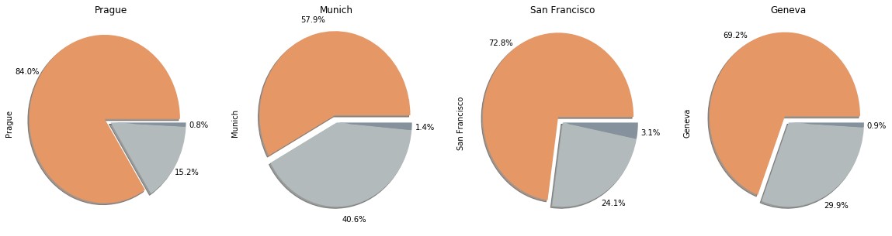

# stories_hidden_in_airbnb_data

## Project description
As citizen, tourist and potential landlord,
I was curious what stories AirBnB data reveals.

Specifically, I asked those two questions:
1. How looks the typical guest using AirBnB services? Is it foreigner or countryman? Will data reveal a clear segment in which landlords could specialize?
2. Is Airbnb used primary as home sharing with tourists? Or as a business where entire flats are dedicated to tourists disturbing local housing market?

## Data
Data of the following cities was analyzed and compared:
- Prague
- Munich
- Zurich
- San Francisco

Data for each city was gained from [insideairbnb.com](http://insideairbnb.com/get-the-data.html)
   
## Usage
To reproduce results: 
1. Download the repository 
2. Download the data from [insideairbnb.com](http://insideairbnb.com/get-the-data.html) Files listings.csv and reviews.csv must be placed into the folder `Dataset/City`. For Geneva it's `Dataset/Geneva/listings.csv` and `Dataset/Geneva/reviews.csv`
3. Execute `Stories Hidden in AirBnB Data.ipynb` 
 
## Libraries used
Python 3
- pandas
- matplotlib
- gender_guesser

## Files in the repository
- `Code/Stories Hidden in AirBnB Data.ipynb`: contains code analyzing the data with its results

## Project outcomes

Seems AirBnB is becoming more professional business platform, than platform for sharing unused spaces with visitors.
Results are published on [my blog](https://jmarcan.github.io/jekyll/update/2020/01/25/Stories-Hidden-In-AirBnB-Data.html)

